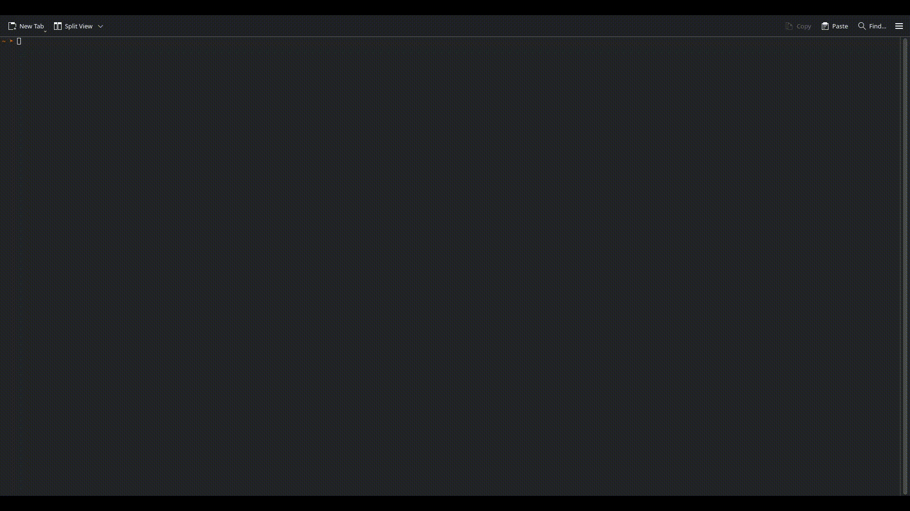
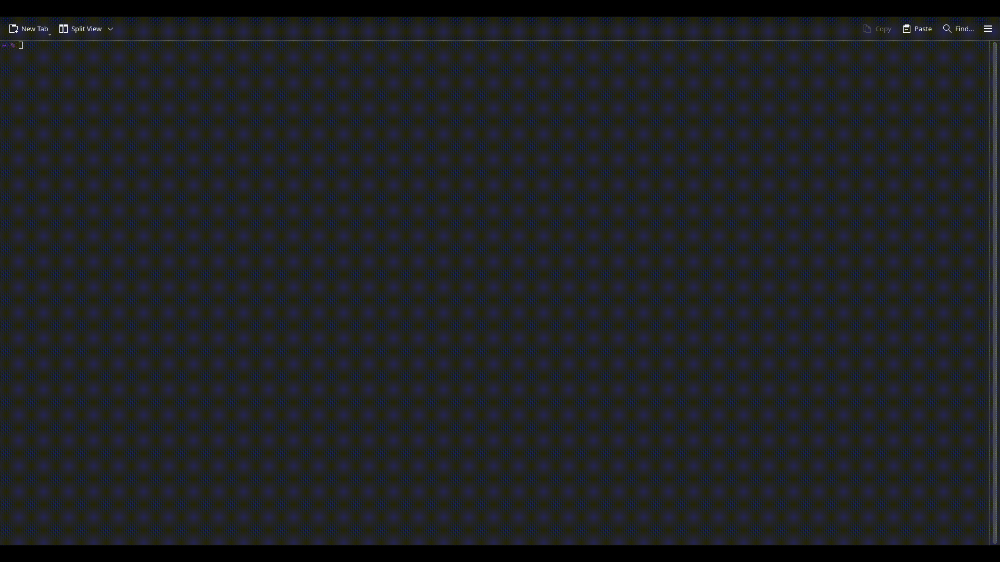

# Internet Archive Uploader 

A simple, reliable Bash script to upload files/folders to [archive.org](https://archive.org) with metadata prompts and progress tracking.

## Demo
[](https://asciinema.org/a/4ZBOHIbpREGIVk7aMRPTLRTeV)


## Features
- Upload single files **or entire folders**
- Interactive metadata prompts (title, creator, year, etc.)
- Auto-generate identifiers or use custom ones
- Real-time progress bar with `pv`
- Fail-safe design with error checking
- Supports all media types (video/audio/text/custom)

## Installation

### Dependencies
1. **Internet Archive CLI (`ia`)**
   ```bash
   pip install internetarchive
   ```
   *Authenticate once:*
   ```bash
   ia configure
   ```
   *(Follow prompts to enter your archive.org credentials)*

2. **Progress Viewer (`pv`)**
   ```bash
   # Debian/Ubuntu
   sudo apt-get install pv

   # macOS (Homebrew)
   brew install pv
   ```

### Get the Script
```bash
curl -O https://raw.githubusercontent.com/eyeblech/archive-uploader/main/archive_upload.sh
chmod +x archive_upload.sh
```

## Usage
```bash
./archive_upload.sh <file_or_folder> [custom_identifier]
```

### Examples:
1. **Upload a single file** (auto ID):
   ```bash
   ./archive_upload.sh documentary.mp4
   ```

2. **Upload folder with custom ID**:
   ```bash
   ./archive_upload.sh ./photos my-vacation-2024
   ```

## Interactive Prompts
The script will ask for:
- Title
- Description
- Creator
- Year (defaults to current year)
- Topics (comma-separated keywords)
- Media type (movies/audio/text/custom)

## Demo (single file)


## Demo (folder)



